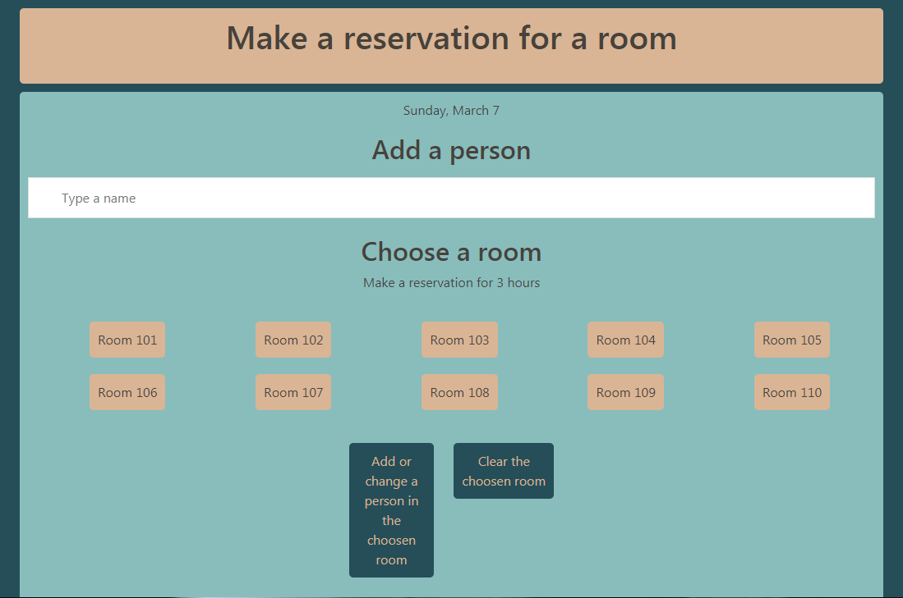

# Rooms

An application that allows you to reserve a room for 3 hours. 

[Website demo](https://agata-nowicka.github.io/rooms/)

 
## General info
 
 In order to make a reservation you have to choose a person from a list or type a new name, then choose a room number and submit with a button. If you want to clear your reservation, choose the room number and use *Clear the choosen room* button.

## Technologies

- Sass
- Bootstrap 4
- HTML5
- JavaScript / ES6 

### Status
The basic version of the project is still in progres. In the future the design will be polished, *change* feature won't clear the choosen name and number, typed name will appear in a modal box, dynamic list will dissapear after pressing *enter* even if there are still matching results. List of proposed results will be connected with a database with names or a name generator (E.g. https://www.fakenamegenerator.com/)
